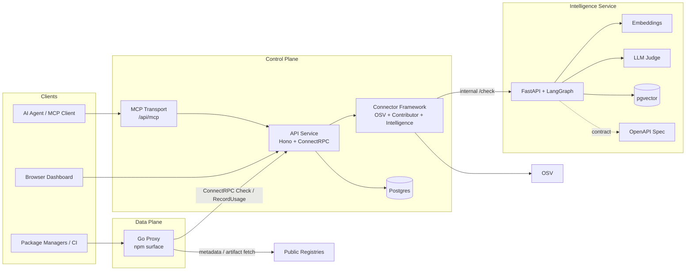
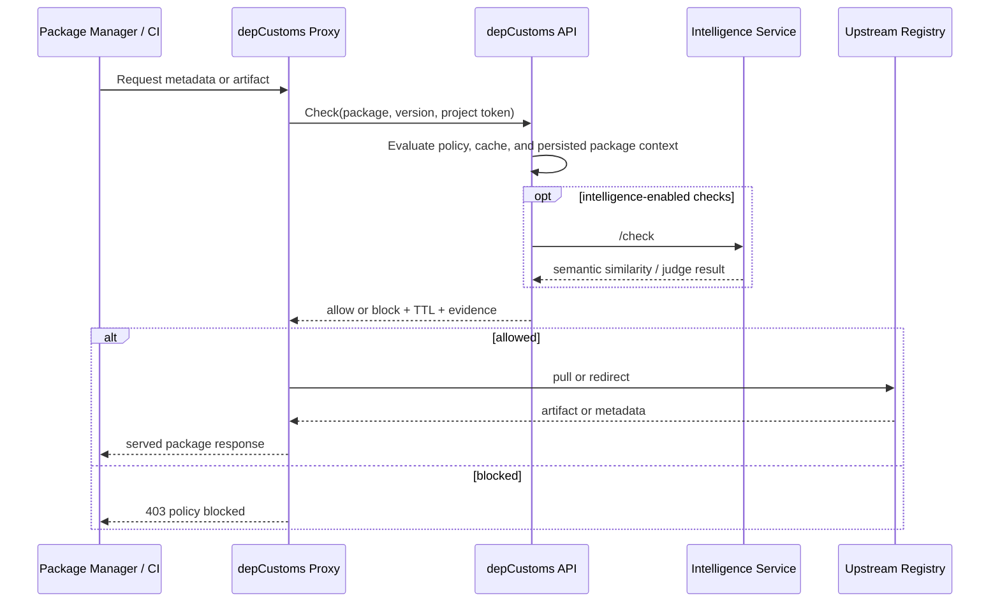

# depCustoms

**depCustoms** is a dependency policy gateway that moves enforcement to the
moment a package is requested, not after it has already landed in your
environment.

Instead of scanning a lockfile after the fact, depCustoms sits between package
managers and public registries, evaluates each request against policy and
intelligence, and either allows or blocks the dependency before it enters your
supply chain. It will then provide full audit tracking, with explainability, for
both humans and AI agents.

> **Status: pilot.** The npm flow runs end to end across proxy, policy,
> intelligence, dashboard, and MCP. Architecture is settled; active work is on
> corpus growth, threshold tuning, performance under load, and PyPI. See
> [Project Status: Pilot](#project-status-pilot) below for the full breakdown.


## What Makes depCustoms Different

- **Request-time enforcement, not post-hoc scanning.** Policy runs before a
  dependency is downloaded, so a blocked package never lands on a developer
  machine, a build agent, or a production image.
- **Pluggable intelligence, not a fixed CVE feed.** A typed connector framework
  lets you compose vulnerability data, contributor and provenance signals, and
  semantic typosquat detection into a single policy decision, and add your own
  signals without forking.
- **Agent-native explainability.** Every decision is traceable through the
  dashboard and through an MCP server with purpose-built tools, so AI coding
  agents can ask why a package was blocked and what to do instead.
- **Self-hostable end to end.** The OSS distribution ships the proxy, control
  plane, dashboard, and intelligence service. Not a thin demo wrapped around a
  hosted backend.

## How depCustoms Relates to Socket.dev, Snyk, and Friends

If you've evaluated supply-chain security before, you've already met
Socket.dev, Snyk, Phylum, Endor Labs, and GitHub Advanced Security.
Those vendors sell signal: telemetry at scale, malware analysts, and
typosquat-hunting teams. depCustoms doesn't try to match them on signal
depth. It's a policy gateway that runs their data, and your own, inside
an environment you control.

What depCustoms adds is the layer those providers can't or won't:

- **Self-hostable enforcement at the registry boundary.** Pre-arrival,
  not post-decision via PR comments or CI checks.
- **Composition across providers.** Define one policy that combines
  OSV severity, Socket's risk score, your internal allow-list, and a
  contributor signal in a single rule, without being locked to one
  vendor's proprietary policy language.
- **Air-gappable and sovereignty-friendly.** Runs in environments
  where SaaS scanners can't reach.
- **Agent-native explainability.** MCP tools so a coding agent can
  ask why a package was blocked and what to do instead, without
  leaving the editor.

Socket, Snyk, and Phylum connectors are on the roadmap. depCustoms
doesn't replace those services; it leverages data in environments
where SaaS-only deployment isn't an option.

## Quick Start

The fastest way to run the OSS stack today is the bundled Docker deployment.

Start here:

- [All-In-One Deployment Guide](deploy/docker/README.md)

Then use the service READMEs for service-specific development and configuration:

- [API service](services/api/README.md)
- [Dashboard service](services/dashboard/README.md)
- [Proxy service](services/proxy/README.md)
- [Intelligence service](services/intelligence/README.md)

## The Three Pillars

depCustoms has three jobs: enforce policy at request time, decide which
packages are allowed, and explain why.

### Enforce

A thin Go proxy speaks the npm registry protocol today (PyPI is next), so
existing package managers and CI pipelines work against it without changes.
Every request is evaluated by the control plane before a download is allowed.

- **Fail-closed on cache miss** if the control plane is unreachable
- **Cache-degraded mode** keeps known-good decisions flowing during partial
  outages, with full audit trail
- **Persistent WAL** captures every decision locally, even on crash, and
  flushes to the control plane asynchronously
- **Tenant-bound proxy credentials** Secrets are stored hashed, every RPC is
  validated, and a proxy can only act for the tenant it was registered to.
- **Redirect or pull modes** Return a 302 to the upstream registry when
  artifact streaming is unnecessary, or stream through the proxy when the
  client requires a single host.

### Decide

The control plane evaluates each request through a typed connector framework.
Connectors declare the fields they expose, the policy engine evaluates rules
against those fields, and snapshots are persisted so policy decisions are
auditable and replayable.

Connectors shipped in OSS:

| Connector        | What it adds                                                                                                                                                       |
| ---------------- | ------------------------------------------------------------------------------------------------------------------------------------------------------------------ |
| **OSV**          | Open-source vulnerability advisories: severity, fix availability, best fix version, per-finding detail                                                             |
| **Contributor**  | First-time-publisher detection, maintainer churn, install-script presence, npm provenance, trusted-publisher status, release velocity, scored 0–100 with age decay |
| **Intelligence** | Semantic typosquat and similarity analysis: embedding + lexical retrieval, LangGraph routing, optional LLM judge, with a stub mode for offline and air-gapped use  |

The framework is the product surface; these connectors are examples that
prove it. New connectors register their field catalog at startup, the rule
builder picks them up automatically, and existing rules keep working when
fields are deprecated rather than deleted.

### Explain

Every decision can be traced back to the policy, the connector finding, and
the package metadata that produced it. The dashboard surfaces this for
operators; the MCP server surfaces it for AI development tools.

The MCP transport (`/api/mcp`) ships with purpose-built tools, including:

- `explain_package_decision`: why a package version is allowed or blocked,
  with the active policy and finding context
- `preview_dependency_change`: evaluate a proposed package change under the
  current effective policy before opening a PR
- `suggest_allowed_versions`: surface fix versions that satisfy policy
- `list_recently_blocked_packages`: recent blocks with reason and matching
  rule
- `list_project_findings`, `list_project_violations`,
  `get_project_security_summary`, `get_project_contributor_summary`,
  `list_vulnerable_packages`, `find_projects_using_package`, and more

Coding agents can query the policy directly instead of guessing from a 403.

## Architecture

depCustoms splits the data plane from the control plane. The proxy stays thin
and registry-compatible. The API owns policy, persistence, MCP, and connector
orchestration. The intelligence service adds semantic package analysis behind
a small internal API.



### Request-Time Enforcement Flow



For deeper architecture notes, see [docs/architecture.md](docs/architecture.md).

## Core Components

| Service          | Role                                                                                                            |
| ---------------- | --------------------------------------------------------------------------------------------------------------- |
| **Proxy**        | Go enforcement point for npm-compatible traffic (PyPI on the roadmap)                                           |
| **API**          | TypeScript control plane for policy evaluation, persistence, auth integration, MCP, and connector orchestration |
| **Dashboard**    | Next.js operator UI for tenants, projects, proxies, policy, findings, and runtime visibility                    |
| **Intelligence** | Internal semantic package-intelligence service for typosquat and similarity analysis                            |

## Service Documentation

- [API service README](services/api/README.md)
  - REST API, ConnectRPC gateway, bootstrap flow, MCP surfaces, auth
    integration, and OpenAPI export
- [Dashboard service README](services/dashboard/README.md)
  - operator UI, browser auth flow, same-origin routes, and runtime
    configuration
- [Proxy service README](services/proxy/README.md)
  - registry traffic handling, metadata rewriting, runtime-token flow, and WAL
    delivery
- [Intelligence service README](services/intelligence/README.md)
  - semantic `/check` flow, `/seed` ingestion, live vs stub mode, and OpenAPI
    export

## Open Source Scope

The OSS project includes the core platform:

- proxy enforcement
- control-plane policy evaluation and persistence
- dashboard workflows and operational visibility
- pluggable connector framework with OSV, contributor, and intelligence
  connectors shipped
- MCP transport and tool catalog for agent-facing workflows

Current ecosystem posture in OSS:

- **npm**: the supported path today, exercised end to end from proxy through
  policy, intelligence, dashboard, and MCP
- **PyPI**: partially scaffolded, not yet wired end to end; planned as the
  next ecosystem after the npm flow stabilizes

## Project Status: Pilot

depCustoms is a working pilot. The architecture is settled and the npm flow
runs end to end; remaining work is refinement, not construction. The
breakdown below shows what works, what's being tuned, and what isn't there
yet.

### Working today

- request-time enforcement across the npm flow (proxy → policy → decision)
- pluggable connector framework with three shipped connectors: OSV,
  contributor signals, and semantic intelligence
- cascading tenant → project policy with rule preview against historical
  snapshots
- MCP transport with the full agent tool catalog
- multi-tenant dashboard, proxy registration, project tokens, and live
  event stream
- OAuth, internal JWT minting with JWKS distribution, and a real
  role-and-capability model across all services

### In active refinement

- **intelligence corpus and tuning** The pipeline produces real verdicts,
  but verdict quality at scale is a function of the curated corpus,
  similarity thresholds, and judge prompt. Expect false positives and
  false negatives on long-tail packages while these are tuned.
- **performance and scale validation** Caches, WAL, and horizontal proxy
  scaling are designed in but want broader real-world validation.
- **dataset growth** Scaling the corpus to cover the long tail of npm
  is where the bulk of the remaining intelligence work lives.

### Not yet there

- **PyPI** end-to-end. Proxy is partially scaffolded; full pipeline coming
  after the npm flow stabilizes.
- **third-party data connectors** Socket.dev, Snyk, Phylum, and GitHub
  Advanced Security are all designed-for in the connector framework but
  not yet built; these will let operators compose those vendors' signals
  with depCustoms's own.
- **additional first-party connectors** Dependency-graph signals, SBOM
  ingestion, and similar enrichment paths are designed for but not yet built.
- **production load testing at scale** Single-tenant and small-multi-tenant
  exercise has happened; large-scale validation is on the roadmap.

depCustoms today is a serious starting point, not a turn-key product. Treat
intelligence verdicts as one signal in a layered policy alongside CVE and
contributor rules. Release notes will track the rough edges as they get
filed; link coming once the first release ships.

<!-- TODO(release-notes): replace the line above with a real link to
RELEASES.md or a GitHub Releases page once the first tagged release is
published. -->

## Security Model

depCustoms is built around a fail-closed, tenant-scoped control model:

- **Request-time authorization** Package requests are evaluated before
  download.
- **Tenant separation** API resources and dashboard views are tenant-scoped.
- **Role and capability enforcement** API endpoints and UI surfaces are
  gated by explicit capabilities.
- **Proxy credentials** Proxy secrets are stored hashed, never in plaintext,
  and bound to a single tenant.
- **Fail-closed behavior** Cache misses with an unreachable control plane
  are blocked.
- **Internal service boundaries** Intelligence and internal bootstrap flows
  use explicit internal auth and secret-protected setup surfaces.

## Repository Structure

```text
oss/
  contracts/   Shared specs and interface definitions
  deploy/      Deployment assets and bundled all-in-one setup
  docs/        Supplemental architecture and image assets
  examples/    Runnable examples and package-manager test flows
  services/    Open-source service implementations
  README.md    This file
```

## Contributing

Contributions are welcome. Open an issue before submitting a large change so we
can align on scope and direction first.

## License

depCustoms is licensed under the
[GNU Affero General Public License v3.0](LICENSE) (AGPLv3).

Commercial licenses are available for organizations that cannot accept AGPLv3
terms or that want access to proprietary features. For licensing questions,
contact [@DigitalBites](https://github.com/DigitalBites) or open an issue in
this repository.
