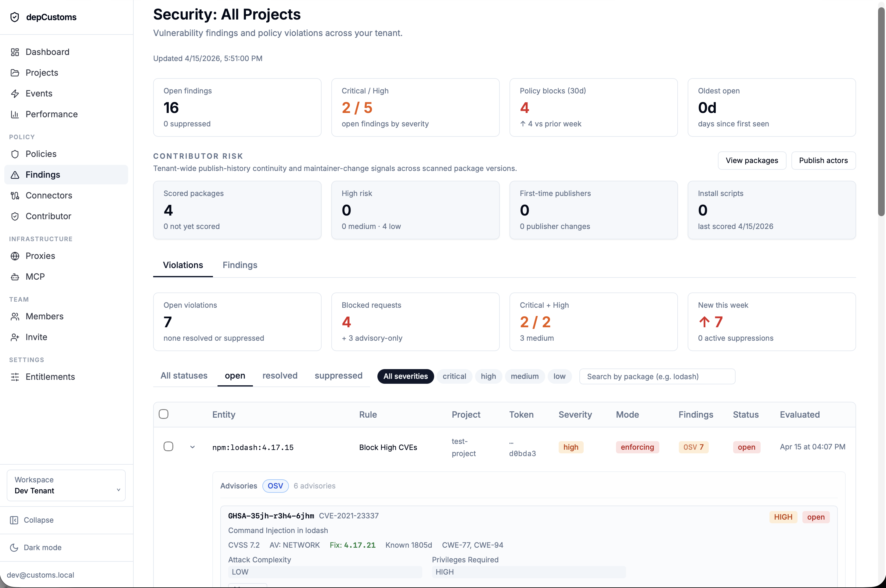
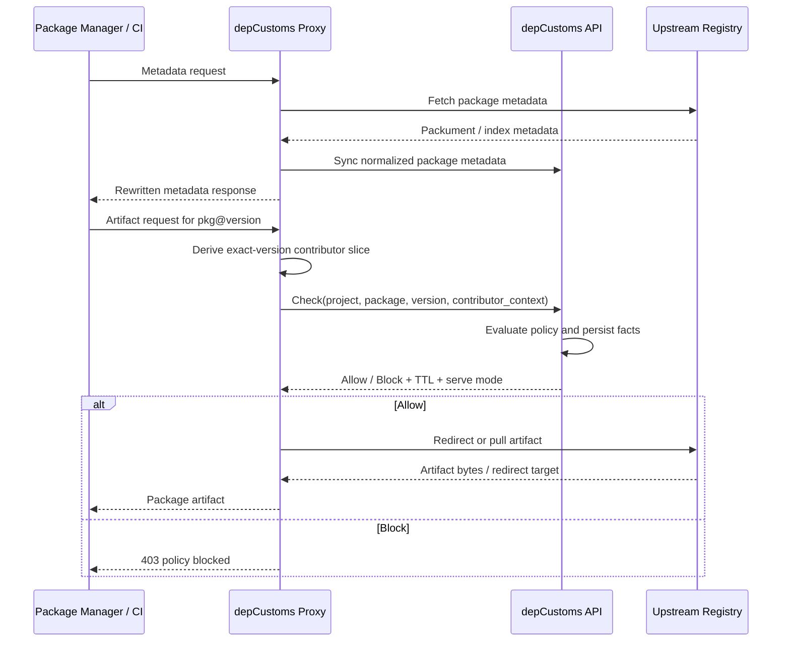

# depCustoms

**Dependency Customs** — a dependency policy gateway that moves the control point to the moment a package is requested, not after it lands.

Most teams discover vulnerable or risky dependencies after the fact. depCustoms sits between your package managers and public registries, evaluating every dependency request against policy, vulnerability intelligence, and historical signals — then allowing or blocking it before it enters your supply chain.

## Origin

depCustoms started as a personal project with a few specific goals: get deeper into Go and TypeScript, build something designed for agentic and AI-driven development workflows from the start, and apply architecture experience to a problem worth solving at scale.

The problem that emerged was dependency risk. Engineering pipelines have grown increasingly complex, pulling in more third-party packages across more ecosystems, and that growth has introduced a steady stream of supply chain incidents. Most tooling in this space tells you about the problem after a dependency has already landed. That felt like the wrong control point.

depCustoms is an attempt to move enforcement earlier — to the moment a package is requested — and to build the visibility and intelligence layer that makes that enforcement useful rather than just obstructive.

## Overview



## Why depCustoms

- **Enforce at request time** — policy runs before a dependency is downloaded, not after a scan
- **No workflow changes** — registry-compatible for npm and PyPI; developers and CI pipelines keep working as-is
- **Multi-tenant by design** — tenant and project isolation built in from the start
- **Explainable decisions** — every allow or block is traceable to a policy rule, finding, or metadata signal
- **Agent-native** — MCP integration exposes dependency intelligence and policy context directly to AI development workflows

## Core Components

depCustoms is organized around three services:

| Service | Role |
|---|---|
| **Proxy** | Registry-compatible enforcement point for npm and PyPI traffic |
| **API** | Control plane — policy evaluation, connector intelligence, persistence |
| **Dashboard** | Operator interface for governance, investigation, and visibility |

## Architecture

The proxy and API follow a policy-enforcement / policy-decision split. The proxy is intentionally thin; the API owns all policy logic and persistence.



For detailed per-service diagrams, see [docs/architecture.md](docs/architecture.md).

## Security Model

depCustoms is built around a full-capability security model from the start:

- **Authentication** — Email magic link and password flows included. GitHub and Google OAuth are supported and can be configured for your deployment.
- **Authorization** — Role-based access control across tenant and project boundaries, enforced at the API layer. Permissions are modeled as discrete capabilities (e.g. `connector.read`, `policy.write`) scoped per role — both UI screens and API endpoints are gated at this level.
- **Session integrity** — Standard JWT-based sessions throughout; no proprietary token formats.
- **Tenant separation** — All resources are scoped to a tenant. Cross-tenant access is not possible by design.
- **Proxy credentials** — Proxy secrets are hashed on receipt and never stored in plaintext.
- **Fail-closed** — A proxy with no cached decision and an unreachable control plane blocks the request. Permissive fallback is not an option.

## Open Source Scope

The open-source project covers the full core platform:

- Proxy enforcement
- Control plane policy evaluation
- Dashboard and operational visibility
- Normalized package and contributor intelligence
- AI tool integration via MCP

## Getting Started

> Documentation and quickstart guide coming shortly.

## Repository Structure

```text
oss/
  contracts/   Shared specs and interface definitions
  deploy/      Deployment-oriented materials
  docs/        Supplemental documentation
  services/    Open-source service implementations
  README.md    This file
```

## Contributing

Contributions are welcome. Please open an issue before submitting a pull request for significant changes.

## License

depCustoms is licensed under the [GNU Affero General Public License v3.0](LICENSE) (AGPLv3).

Commercial licenses are available for organizations that cannot accept AGPLv3 terms or that wish to access proprietary features. Contact [opensource@digitalbites.dev](mailto:opensource@digitalbites.dev) for details.
