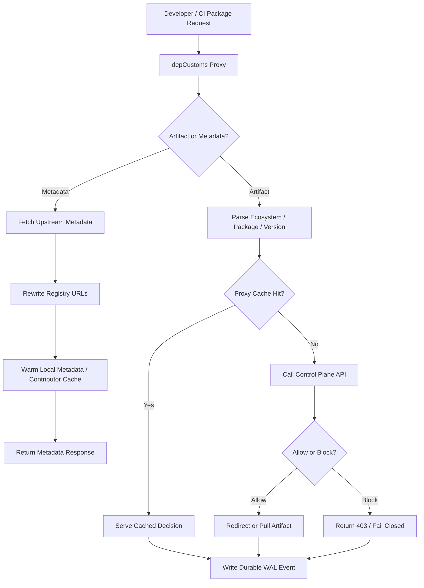
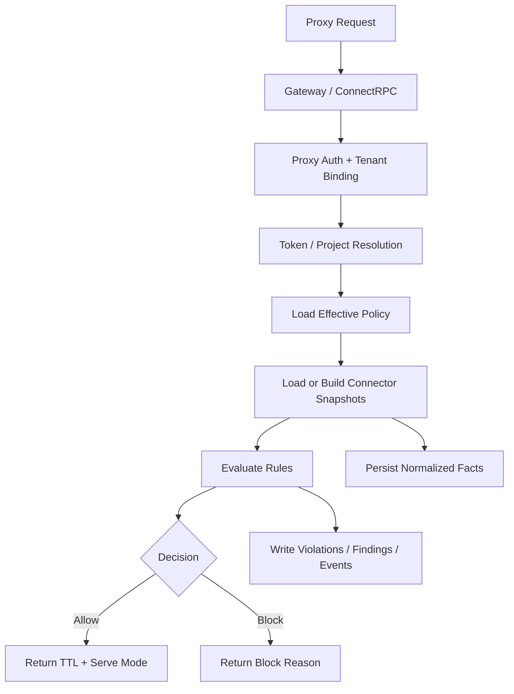
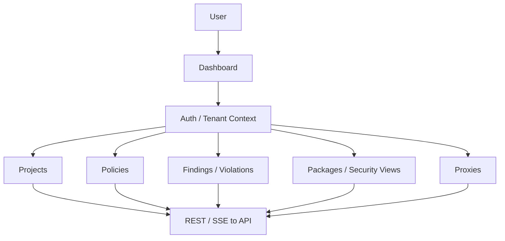

# depCustoms Architecture

Detailed service-level architecture diagrams. For a high-level overview, see the [README](../README.md).

## Proxy

The proxy is the data-plane entry point. It parses dependency requests, checks local cache, asks the API for policy decisions when needed, and records durable usage events.

## API (Control Plane)

The API validates proxy identity, resolves policy, evaluates connector intelligence, persists normalized facts, and records decisions.

## Dashboard

The dashboard is the operator-facing control surface. It manages tenant configuration, projects, policies, findings, package intelligence, and proxy operations.

