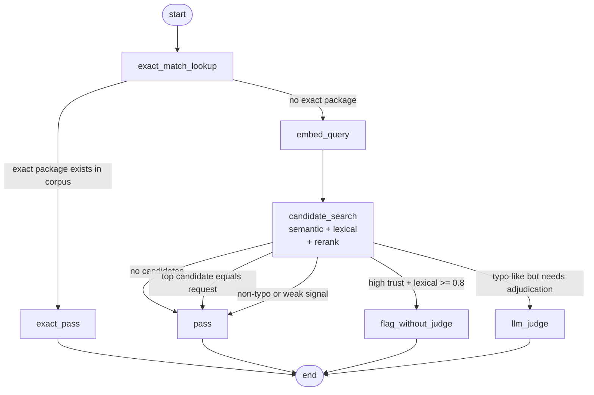

# Customs Intelligence Service

Scope: `services/intelligence`

## Overview

The intelligence service is the internal semantic-typosquat and package-similarity
service used by the API’s intelligence connector. It exposes a small internal
HTTP surface for `/check` and `/seed`, manages its own corpus and migrations,
and supports both stubbed local mode and live OpenAI-backed evaluation.

## Quick Start

For the overall OSS stack and bundled deployment, start at the
[root README](../../README.md).

For local intelligence-only development:

```bash
python3 -m venv .venv
. .venv/bin/activate
python -m pip install -r requirements.txt -r requirements-dev.txt
uvicorn app.main:app --reload --port 8001
```

The service depends on the API JWKS for internal auth and on PostgreSQL for
corpus-backed behavior. Live mode also requires `OPENAI_API_KEY`.

## Tech Stack

- Python
- FastAPI
- SQLAlchemy
- LangGraph
- pytest
- Ruff

## What This Service Does

- exposes internal `/check` and `/seed` HTTP endpoints behind internal bearer
  auth
- runs the semantic package-check flow used by the API intelligence connector
- supports stub-mode embeddings, neighbor search, and judge paths for local
  iteration
- manages corpus loading, retrieval helpers, and package-seed pipelines
- maintains its own Alembic migrations and intelligence schema
- exports an offline OpenAPI artifact for the current API contract
- enforces request-size limits, per-caller `/check` rate limits, and service
  concurrency limits

## Runtime Surfaces

- `GET /healthz`
  - unauthenticated health endpoint
- `POST /check`
  - internal authenticated package intelligence check path
- `POST /seed`
  - internal authenticated seed-ingestion path

The service keeps live OpenAPI and interactive docs disabled at runtime. The
machine-readable API contract is exported offline to `docs/openapi.json`.

### `/check` Flow



For the fuller maintained Mermaid source, see
[`docs/diagrams/check_graph.curated.mmd`](docs/diagrams/check_graph.curated.mmd).

## Authentication Model

- `/healthz` remains unauthenticated
- `/check` and `/seed` require a bearer token signed by the control plane
- the service verifies that token against the API JWKS exposed at
  `/.well-known/internal-service-jwks.json`
- the service uses `token_type` from the JWT as its internal role source
- capabilities are derived from that token type rather than checked ad hoc per
  endpoint

Current token types:

- `api_connector`
  - grants `intelligence.check`
- `api_admin`
  - grants `intelligence.check`
  - grants `intelligence.seed`

`/seed` is intentionally global rather than tenant-scoped. It is a privileged
internal operation guarded by the `intelligence.seed` capability, which
currently only `api_admin` tokens receive.

## Development

### Install

```bash
python3 -m venv .venv
. .venv/bin/activate
python -m pip install -r requirements.txt -r requirements-dev.txt
```

### Run Locally

```bash
. .venv/bin/activate
uvicorn app.main:app --reload --port 8001
```

Default port: `8001`

### Build

The service is typically run directly with `uvicorn` in development or built
through its Dockerfile in containerized environments.

### Tests

```bash
. .venv/bin/activate
python -m pytest
```

Some tests require `DATABASE_URL` for integration coverage. Live OpenAI-backed
behavior is not required when `INTELLIGENCE_STUB_MODE=true`.

### Database

```bash
. .venv/bin/activate
alembic upgrade head
```

### OpenAPI Export

```bash
. .venv/bin/activate
python scripts/export_openapi.py
```

This writes the current machine-readable API contract to `docs/openapi.json`.

## Configuration

The intelligence service reads its runtime configuration from
`app/core/config.py`.

| Variable | Default | Description |
| --- | --- | --- |
| `ENVIRONMENT` | `development` | Environment label used for service behavior and startup logging. |
| `DATABASE_URL` | empty | PostgreSQL connection string for the intelligence schema. Required for non-stub database-backed operation. |
| `INTELLIGENCE_DB_SCHEMA` | `intel` | PostgreSQL schema name used by the service tables and queries. |
| `OPENAI_API_KEY` | empty | OpenAI API key used by the embedding and judge clients when stub mode is disabled. |
| `EMBEDDING_MODEL` | `openai/text-embedding-3-small` | Provider-qualified embedding model identifier for request and corpus embeddings. |
| `JUDGE_MODEL` | `openai/gpt-4o-mini` | Provider-qualified judge model identifier for semantic package classification. |
| `INTELLIGENCE_PORT` | `8001` | HTTP port the FastAPI app listens on. |
| `LOG_LEVEL` | `info` | Service log verbosity. |
| `INTELLIGENCE_REQUEST_BODY_LIMIT_BYTES` | `16384` | Maximum accepted HTTP request body size before the service returns `413 request_too_large`. |
| `INTELLIGENCE_CHECKS_PER_MINUTE` | `120` | Per-caller sliding-window limit for authenticated `/check` requests. |
| `INTELLIGENCE_CHECK_CONCURRENCY` | `8` | Maximum number of `/check` requests allowed to execute concurrently before the service returns `503 service_busy`. |
| `SIMILARITY_LOW_THRESHOLD` | `0.85` | Lower similarity threshold used by retrieval and verdict logic. |
| `SIMILARITY_HIGH_THRESHOLD` | `0.97` | Higher similarity threshold used by retrieval and verdict logic. |
| `SEARCH_TOP_K` | `5` | Number of top semantic candidates retrieved before reranking. |
| `INTELLIGENCE_STUB_MODE` | `false` | Enables stubbed local behavior for embeddings, judging, and other runtime services. |
| `INTELLIGENCE_INTERNAL_JWKS_URL` | `http://localhost:3000/.well-known/internal-service-jwks.json` | JWKS endpoint used to verify internal bearer tokens. |
| `INTELLIGENCE_INTERNAL_JWT_AUDIENCE` | `customs-intelligence-rpc` | Expected audience claim for internal bearer tokens. |

## Important Operational Notes

- `DATABASE_URL` may be provided as either `postgresql://...` or
  `postgresql+psycopg://...`; the service normalizes plain PostgreSQL URLs to
  the SQLAlchemy `psycopg` dialect automatically
- requests larger than `INTELLIGENCE_REQUEST_BODY_LIMIT_BYTES` are rejected
  with `413 request_too_large`
- authenticated `/check` callers are limited by
  `INTELLIGENCE_CHECKS_PER_MINUTE`
- when the service is already handling
  `INTELLIGENCE_CHECK_CONCURRENCY` concurrent `/check` requests, additional
  calls return `503 service_busy`
- stub mode starts without OpenAI-backed embeddings or judge calls
- the API intelligence connector treats service throttling and busy responses as
  temporary unavailability rather than crashing the policy path

## Code Organization

- `app/main.py`
  - FastAPI entrypoint
- `app/core/`
  - config, DB assembly, schema metadata, auth, limits, and error mapping
- `app/checks/`
  - embeddings, graph routing, and judge logic
- `app/domain/`
  - lexical similarity and corpus policy
- `app/repositories/`
  - SQLAlchemy Core persistence adapters
- `app/services/`
  - pipeline and runtime helper services
- `app/evaluation/`
  - offline retrieval experiment helpers
- `sources/`
  - npm collection and normalization helpers
- `scripts/`
  - OpenAPI export, seed pipeline, evaluation, and sanity tooling
- `migrations/`
  - Alembic migrations for the intelligence schema

## Further Reading

- [Root README](../../README.md)
- [OSS Architecture](../../docs/architecture.md)
- [OpenAPI export](docs/openapi.json)
- [Check graph diagrams](docs/diagrams/check_graph.curated.mmd)
- [AGENTS.md](AGENTS.md)
